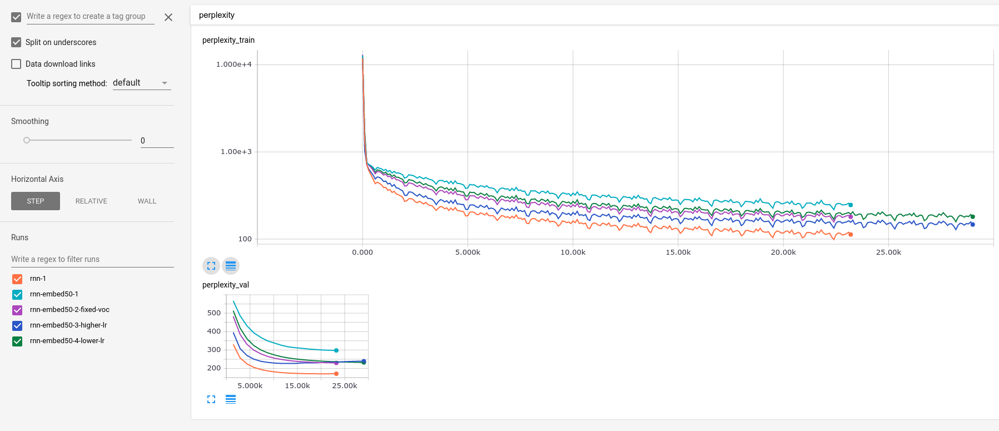

RNN Language model on PTB dataset
=================================

The story
---------
During taking excellent Stanform course CS224D_ taught by Richard Socher, I've
faced problem 2 from lab 2 (L2P2), which is about training simple RNN predicting next word in a sentence.

.. _CS224D: http://cs224d.stanford.edu/

Solution of this problem need to be implemented using tensorflow, but usage of high-level RNN classes
is explicitly prohibited. It's good to get better understanding what's going on, but once you've got
understanding of internal machinery, it's not very useful for large, complicated models, like deep
bidirectional RNN or stacked LSTMs. After having working low-level solution,
I've realized that  there are lot to investigate there, for example:

1. [x] Pre-training word embeddings (original version trains embeddings on the fly),
2. Use larger and deeper model,
3. [x] Use different activation functions (in L2P2 sigmoid was used),
4. Play with LSTM/GRU,
5. Use more unrolling of RNN,
6. etc.

After playing with my L2P2 solution and wasting lots of time finding stupid bugs, I've decided to reimplement
the whole problem from scratch using latest functionality of TensorFlow.

TODO: some text about reimplementation

Pre-trained word embeddings
---------------------------
In CS224D it was noted that it's worth to train embeddings during model learning makes sense when there are lots of
input data. Otherwise, result can be better if we take pre-trained word embedding vectors or train them first as
data preparation step.

To verify this, I've trained vector embeddings on PTB test data using FastText_ from Facebook.

.. _FastText: https://github.com/facebookresearch/fastText

Exact command which was used::

    fasttext skipgram -input ptb.train.txt -output ptb.train.txt-50 -minCount 1 -epoch 1000 -dim 50

To use pre-trained vectors, we need to pass vec-file with vectors to ptb_rnn_train.py using -e option::

./ptb_rnn_train.py -n rnn-embed50-4-lower-lr -e data/ptb.train.txt-50.vec

Resulting perplexity is here:

Result is worse, which can be explained by significant reduction of model's flexibility and size. By pre-training
embeddings, we've fixed about 50*10000=500k parameters (~1/3 of whole model), which were used before, but now become
fixed.

Maybe, it's worth to try appropriate increase of model's size, but I'm not ready for this yet (it should be
done as separate experiment, fixing other variables)

Activation functions
--------------------
In L2P2 sigmoid activation was used, which surprised me a bit. I've played with functions a bit:
1. tanh
2. relu
3. relu6
4. elu

Result:

.. image:: activation-functions.png

**Summary**: relu/relu6 is behaving the worst (I think it's due to expanding/vanishid gradient problem),
tanh (default option in BasicRNNCell) is the winner, elu is a bit better than tanh, but starts to overfit sooner.

Model size
----------
There are two ways to vary model size: width and depth (or both). Depth means more layers
inside the cell, width is just size of the cell itself.

Amount of layers in default setup doesn't make much effect on resulting quality. Larger cells
tend to overfit very quickly.
